# afterClassroom

## Stack

## Frontend

visit https://github.com/ld-amaya/afterClassroom

 &nbsp;
 &nbsp;
 &nbsp;
 &nbsp;
 &nbsp;
 &nbsp;

### Backend

 &nbsp;
<a href ='https://expressjs.com/'>  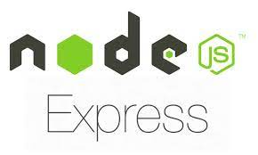 </a> &nbsp;
 &nbsp;
 &nbsp;

### API
This project sources its own data directly from an Accounting Teacher. 

> Run command on your terminal
> -   cd backend
> -   createdb testbank
> -   craetedb testbank_test
> -   psql testbank < testbank.sql

## SCRIPTS

### npm install

Installs the necessary dependencies to run the project
View dependencies and scripts on package.json for both backend and frontend

### nodemon server.js
Runs backend server on local 3001

### npm start' 
Runs frontend server on local 3000

### jest -i 
Runs integration and unit tests.

## ABOUT
We all know the pandemic brought us a new normal, and lucky for some sectors or organization who have been built to handle work-from-home or remote work. But for most of the business, especially schools from third world country like the Philippines, their current system is not at all ready.
This project is inspired in providing a solution to a school problem. afterClassroom tries to connect the student and teachers so that education can still continue to flow even remotely.
afterClassroom is an ecosystem for teachers and students where students can take practice exam using the test questions uploaded or provided by their own teachers. 
The goal of this project is much more bigger, this mvp will allow us to identify the path and prioritize functionalities that the teachers and students needs.

> NOTE:
> - This is an MVP project with one teacher and his students. This allows us to build and learn fast.
> - Temporarily, all subject included are in Accounting
> - Since this is still in MVP, only students are allowed to register. Teachers will be included in the next development cycle.

## User Flow
The following explains the program flow and its functionalities.

### User Registration / Login
Registration is needed to be able to browse the current application. Only students are allowed to regsiter in the current development since this is still on an MVP stage.

To register, a user must enter their username, password, first name, last name and email.

> There are no username duplications allowed in the registration process

    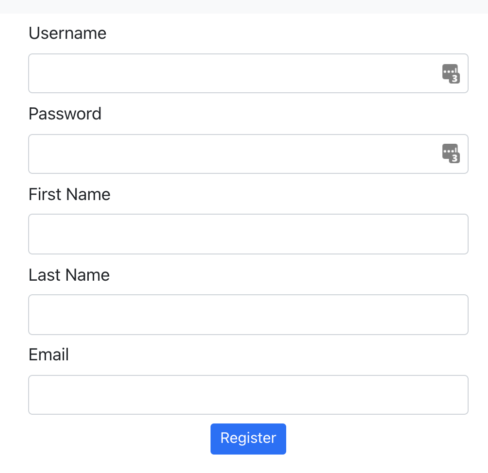

The user will be automatically signed in once registered.

To login, a user must enter their username and password.

    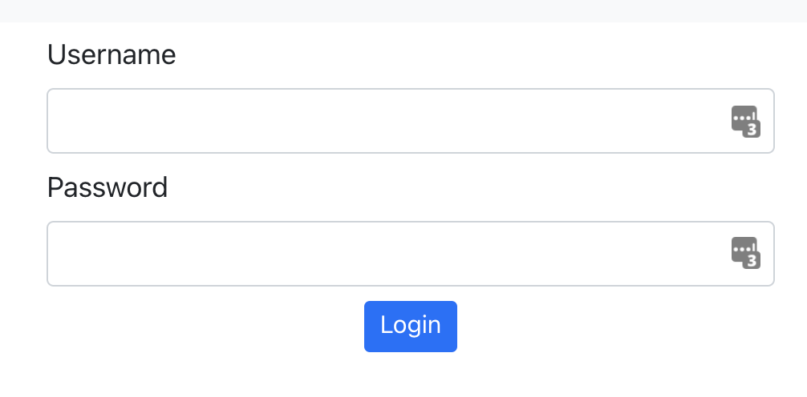

### Topics

A student can select a topic and Take Exam.

    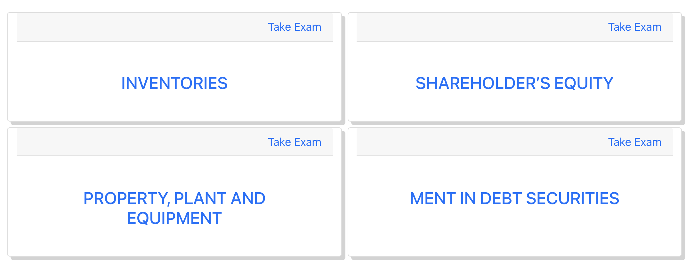

A teacher has more functionality - adding, editing and deleting topics.

    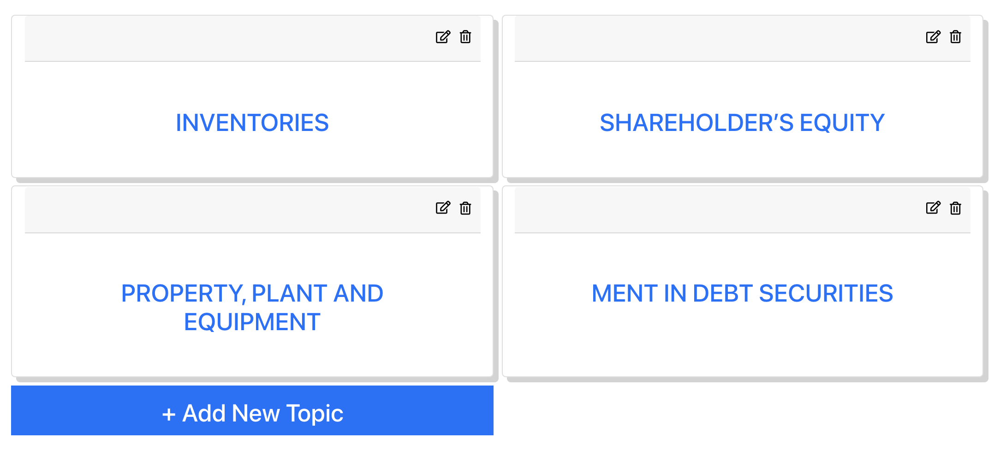

#### Adding / Editing Topic for teachers

    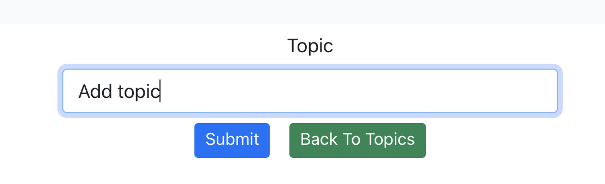

#### Deleting Topics for teachers
Only teachers are allowed to add, edit or delete a topic. Deleting topic will delete all questions related to the topic, a popover warning will display for information.

    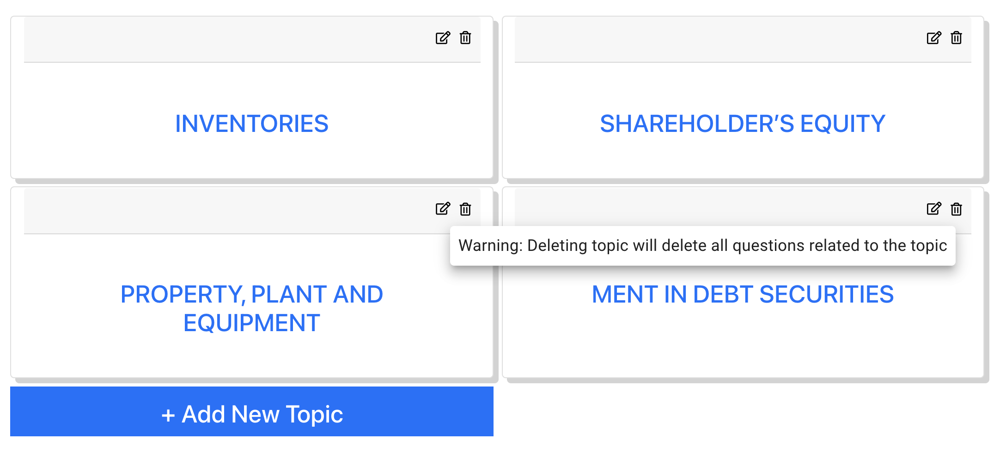

### Questions
Only teachers will have access to all the questions.

    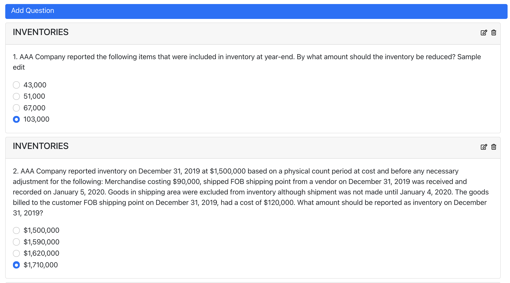

### Deleting Questions

Click the trash icon on the upper right portion of the question card to delete a question.

#### Adding / Editing Questions
To add a question, click the edit icon on the upper right portin of the question card. 
You need to select the topic, add questions, choices and click the correct answer before hitting submit.

    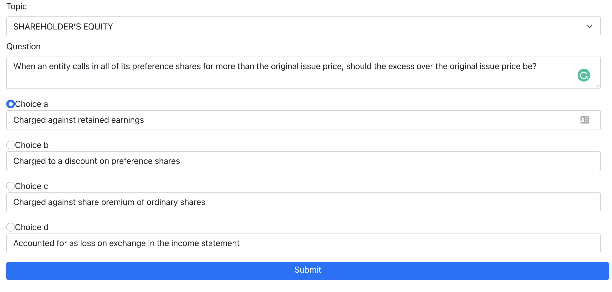

### Taking Exam
Taking new exams are only applicable to the students, click the take exam on the Topics Card then click start to begin the exam.

> Currently, we are providing 10 random questions from our databank. More questions will be uploaded regularly by the teacher.

    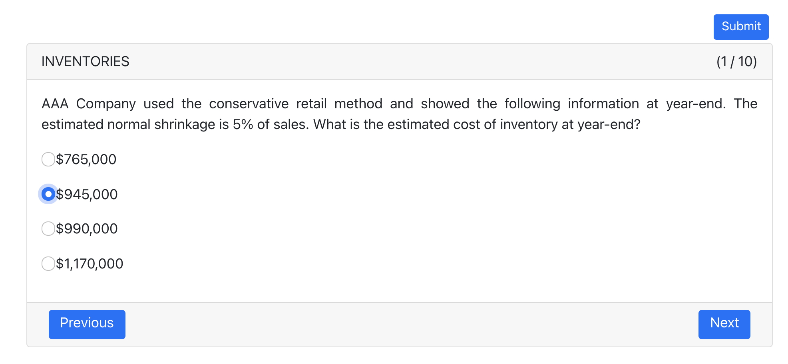

Student can navigate between questions during the exam and change answer if necessary.
Once done, the student clicks the submit button on the right top portion of the question card.

### Summary
Summary table of the exam results are available for both students and teachers. 
Only can only see their own exam results while the teacher can see all their students.

    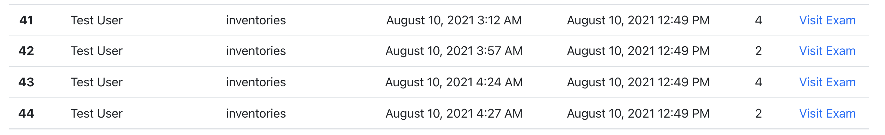

### Exam Review

The students cannot review the exam for now, the teachers can review the exam.

    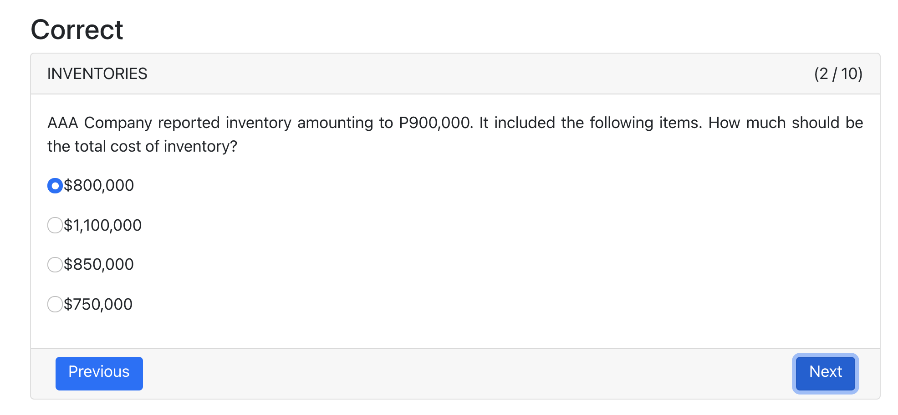

